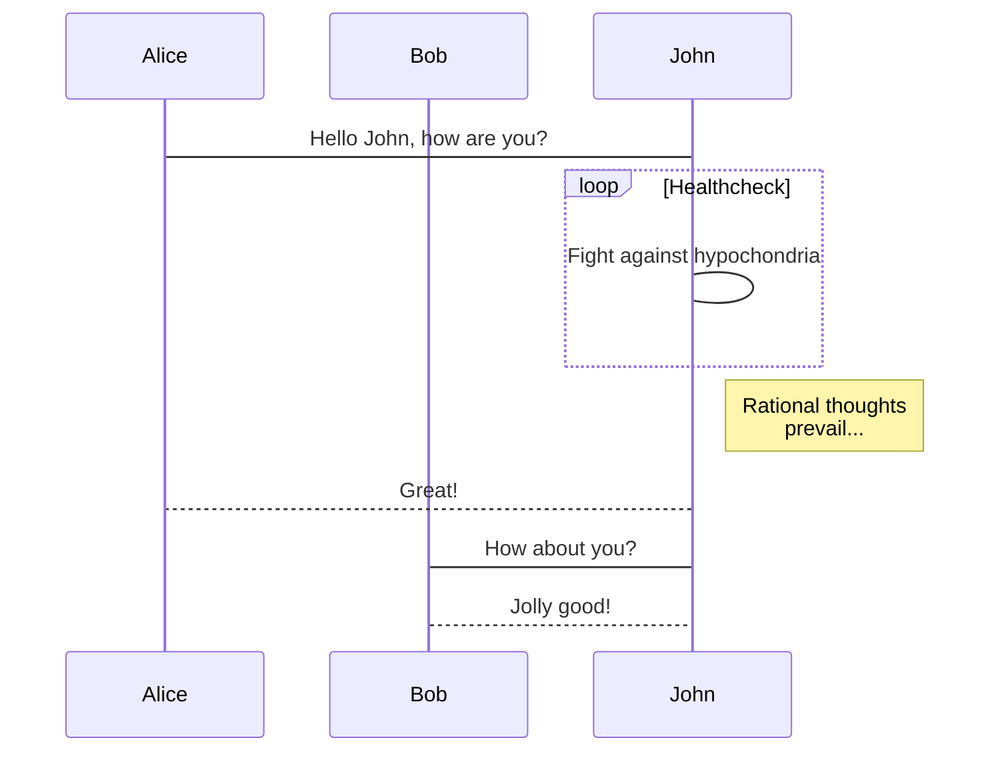

## Heading 2


## Emphasis

*Italics*

**Bold**

~~Strikethrough~~


## List

### Ordered

1. First item
2. Second item

### Unordered

+ First item
  - Item 1.1
    * Item 1.1.1


## TODO

- [ ] Write code


## Images


## Emojis

See the [Emoji cheat sheet](http://www.webpagefx.com/tools/emoji-cheat-sheet/) for available emoticons.

Example: 

```
I : heart : Academic : smile :
```

I :heart: Academic :smile:


## Quote

### Block quote

```
> This is a blockquote.
```

> This is a blockquote

### Highlight quote

```
This is a highlighted quote.
```

This is a <hl>highlighted quote</hl>.


## Footnotes

I have more [^1] to say. 

[^1]: Footnote example


## Diagrams

### Flowchart


### Sequence diagram



### Create diagram using draw.io

1. Create diagram in [draw.io](https://draw.io/)
2. Embed in Academic by choosing **File > Embed > SVG** in the [draw.io](https://draw.io/) editor and pasting the generated code into your page.


## Code highlighting

```python
print('Hello World!')
```


## Math

Inline math: $\nabla F(\mathbf{x}_{n})$

Math block:
$$
\gamma_{n} = \frac{ 
\left | \left (\mathbf x_{n} - \mathbf x_{n-1} \right )^T 
\left [\nabla F (\mathbf x_{n}) - \nabla F (\mathbf x_{n-1}) \right ] \right |}
{\left \|\nabla F(\mathbf{x}_{n}) - \nabla F(\mathbf{x}_{n-1}) \right \|^2}
$$

$$
\begin{aligned}
x &= (3 * 4) + 5 \\\\
&= 12 + 5 \\\\
&= 17
\end{aligned}
$$


## Table

| Command         | Description         |
| --------------- | ------------------- |
| `hugo`          | Build your website. |
| `hugo serve -w` | View your website.  |


## Asides

Asides are a useful feature that **add side content such as notes, hints, or warnings to your articles**. They are especially handy when writing educational tutorial-style articles or documentation.

### Note

{} 

A Markdown aside **is** useful **for** displaying notices, hints, **or** definitions to your readers. 

{}

### Warning

{} 

Here's some important information... 

{}


